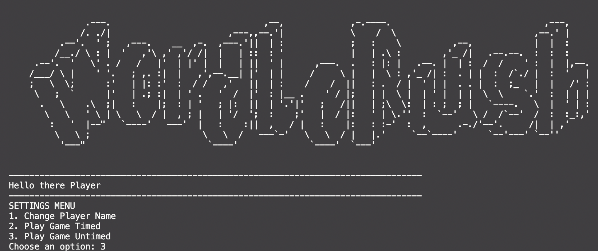

# WordleRush

## Introduction

WordleRush is an innovative, terminal-based version of the popular Wordle game, enhanced with a multitude of game modes and interactive features. This project transforms the traditional Wordle experience into a dynamic and engaging activity, suitable for all types of players.

## Features

### Multi-Mode Gameplay

- **Timed Mode**: Challenge yourself under time constraints with options for 30, 60, or 120 seconds.
- **Untimed Mode**: Enjoy the game at your own pace, ideal for those who prefer a more relaxed experience.

### Customizable Word Lengths

- Players can choose the length of the words they wish to guess, adding variety and adjustability to the game.

### Adjustable Difficulty Levels

- Select your desired difficulty level, which will determine the number of attempts you have to guess each word correctly.

### Hints and Give Up Options

- Struggling with a word? Use the hint feature for some help, or opt to give up and move on to the next challenge.

### Score Tracking

- Keep an eye on your progress with a scoring system that tracks your performance across all modes, helping you to see how you're improving over time.

## User Interface

WordleRush utilizes an intuitive user interface that includes:

- **Main Menu Screens**: Easily navigate through the game mode selections with a user-friendly main menu.
- **Pop-up Messages**: Stay informed and guided with helpful pop-up messages throughout the game.

## Conclusion

WordleRush is more than just a game; it's an experience. Whether you're looking for a quick challenge or a leisurely puzzle, WordleRush has something for everyone. Immerse yourself in the world of words and put your vocabulary to the test with our multi-mode Wordle game.
